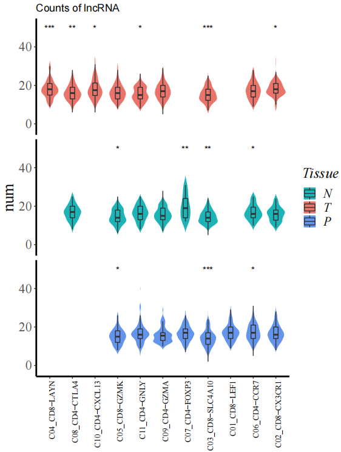
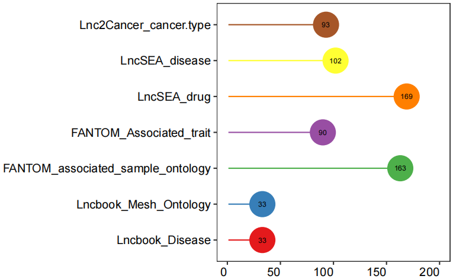

<!-- README.md is generated from README.Rmd. Please edit that file -->

# scLNC: A tool for lncRNA functional analysis in single-cell RNA-seq

## Preparatory work

### Installation

You can install the package as follows:

``` r
# install.packages("devtools")
devtools::install_github("xgaoo/scLNC")
library(scLNC)
```

### Example data

An example data can be downloaded from
[GEO](https://www.ncbi.nlm.nih.gov/geo/query/acc.cgi?acc=GSE98638) with
the commands:

``` shell
wget https://ftp.ncbi.nlm.nih.gov/geo/series/GSE98nnn/GSE98638/suppl/GSE98638_HCC.TCell.S5063.count.txt.gz
wget https://ftp.ncbi.nlm.nih.gov/geo/series/GSE98nnn/GSE98638/miniml/GSE98638_family.xml.tgz
```

You can get a gene expression matrix and cellular metadata.

## Workflow

### 1.Create a scLNC object.

For this tutorial, we will be analyzing the a dataset of T cells from
hepatocellular carcinoma (HCC) patients profiled by Smart-seq2. There
are 4,070 T cells of peripheral blood (Blood), tumor tissues (Tumor) and
adjacent normal liver tissues (Normal) from 5 patients.

We next use the count matrix and cell annotation information to create a
scLNC object. The object serves as a container that contains both data
(like the count matrix and cell annotation information) and analysis
result (like co-expressional pairs and unit activity) for a single-cell
dataset. In the course of the next study, we recommend that users
understand the scLNC object structure.

``` r
LNCobject <- createLRAT(count_table=HCC_rawcount, cell_info=HCC_cellinfo, min.cells = 15, min.genes = 200)
```

In addition, the gene symbols and gene IDs in the matrix can be
converted into the Ensembl gene ID, which is more convenient for
subsequent analysis.

``` r
rownames(HCC_rawcount)=id_convert_fromgtf(genelist=rownames(HCC_rawcount),gtf.info = scLNCgencode)
```

Splits object based on a single attribute into a list of subsetted
objects, one for each level of the attribute. For example, useful for
taking an object that contains cells from many tissues, and subdividing
it into tissue-specific objects.

``` r
LNCobject.list <- splitLRAT(LNCobject, split.item='Tissue')
```

According to the annotation of GENCODE database, the gene types were
classified and counted.

``` r
classification(object = LNCobject, genetype_range = "all")
```

<div class="figure" style="text-align: center">


<p class="caption">
Classification of genes.
</p>

</div>

The expression variance of lncRNAs and mRNAs. The lines denote smoothed
fit to the mean expression for lncRNAs (red) and mRNAs (green). Points
exceed confidence interval of the fit regression are highlighted in red
(high variability) and blue (low variability), respectively. Black
indicates points within the confidence interval (middle variability).
Grey indicates mRNAs. Example genes are labeled.

``` r
scCV2(object=LNCobject,limx = c(-2, 2),labelgene=c('PVT1','LINC00963','LINC00265','LINC00299','MIR155HG','TRG-AAS1','MIAT',
     'LINC00944','LINC00612','LINC00987','LINC01588','MIR181A1HG','LINC00996','LINC00158','LINC00589','MSD2','LINC00158'))
```

<div class="figure" style="text-align: center">


<p class="caption">
Dispersion (CV2) against mean expression.
</p>

</div>

Identify the enrichment of cell types under different experimental
conditions (like Tissues). According to the enrichment of cell types in
different tissues, the number of lncRNAs in different cell types in each
tissue was compared.

``` r
celltype_enrich(object=LNCobject)
StatGeneNum(object=LNCobject,genetype='lncRNA',item='Tissue',item.level=c('T','N','P'),split.by='majorCluster', 
disorder=c('C04_CD8-LAYN','C08_CD4-CTLA4','C10_CD4-CXCL13','C05_CD8-GZMK','C11_CD4-GNLY',"C09_CD4-GZMA",'C07_CD4-FOXP3','C03_CD8-SLC4A10','C01_CD8-LEF1','C06_CD4-CCR7','C02_CD8-CX3CR1'))
```

<div class="figure" style="text-align: center">


<p class="caption">
The odds ratio (OR) of cell types in different tissues.
</p>

</div>

<div class="figure" style="text-align: center">


<p class="caption">
The number of detected lncRNAs.
</p>

</div>

We identified marker lncRNA genes across cell types in different tissues
by Seurat, and then demonstrated conserved and tissue-specific marker
lncRNAs by scLNC.

``` r
DotFeatures(object=LNCobject,features=unique(DE_l$gene),item="majorCluster",mytitle= NULL,split.by='Tissue',mincell.peritem=15)
```

<div class="figure" style="text-align: center">


<p class="caption">
The expression of the marker lncRNAs of each cell type in each tissue.
</p>

</div>

To imply potential functions of lncRNAs, scLNC provides annotations of
associated cell type, disease and drug of lncRNAs from multiple
databases. And lncRNA-mRNA interaction databases can infer lncRNA
functions by related mRNAs.

``` r
lncRNADatabase(features=LNCobject@ gene.list$ lncRNA)
lncRNA_mRNADatabase(features=LNCobject@ gene.list$ lncRNA)
```

<div class="figure" style="text-align: center">


<p class="caption">
The number of lncRNAs in HCC dataset with annotations in lncRNA
databases.
</p>

</div>

<div class="figure" style="text-align: center">


<p class="caption">
The number of lncRNAs in HCC dataset with annotations in lncRNA - mRNA
databases.
</p>

</div>

### 2. Build lncRNA units and annotate the lncRNA-mRNA co-expression pairs.

The count matrix slot is now ready for the co-expression analysis. The
process also includes annotation of information on gene types,
co-expression relationship pair types, cis and trans, and distances on
lncRNA and mRNA genomes.

In this tutorial, we performed gene coexpression calculations for each
tissue data.

``` r
LNCobject.list <- splitLRAT(LNCobject, split.item='Tissue')
rdata_T=CaculateCorelation(object=LNCobject.list[['T']],fileName='T')
rdata_N=CaculateCorelation(object=LNCobject.list[['N']],fileName='N')
rdata_P=CaculateCorelation(object=LNCobject.list[['P']],fileName='P')
```

The output results of the above coexpression calculation were read in,
and the distribution map of correlation coefficient distribution was
displayed through scLNC. Pairs were divided into four groups based on
the genomic distance between lncRNA and mRNA (titrated colors).

``` r
CoexpPairs_cis_cor=read.csv("new_T_lm.csv",head=TRUE,stringsAsFactors=FALSE)
CoexpPairs=CoexpPairs_cis_cor[,c('cor','locus_distance_range')]
CorDensity(CoexpPairs)
```

<div class="figure" style="text-align: center">


<p class="caption">
Cumulative distribution of correlation coefficients of co-expressed
lncRNA-mRNA pairs.
</p>

</div>

Users can filter the lncRNA-mRNA pairs with high correlation
coefficients as co-expression pairs according to the data.

``` r
LNCobject_T=LNCobject.list[['T']]
LNCobject_N=LNCobject.list[['N']]
T=read.csv("new_T_lm.csv",head=TRUE,stringsAsFactors=FALSE)
N=read.csv("new_N_lm.csv",head=TRUE,stringsAsFactors=FALSE)
LNCobject_T=FilterPairs(da ta=rdata_T, object=LNCobject_T,corcut=mean(T$cor)+3*sd(T$cor),RPSL=FALSE,targetcut=0)
LNCobject_N=FilterPairs(da ta=rdata_N, object=LNCobject_N,corcut=mean(N$cor)+3*sd(N$cor),RPSL=FALSE,targetcut=0)
```

LncRNA and its paired mRNAs were defined as a functional unit. Bar plot
shows the number of the mRNAs in each lncRNA unit in tumor and normal
tissue.

``` r
bar_stat_units(object.list=LNCobject.list[c('T','N')])
```

<div class="figure" style="text-align: center">


<p class="caption">
The number of the mRNAs in each lncRNA unit in T cells between tumor and
normal tissues.
</p>

</div>

Relevant annotation of lncRNA-mRNA co-expression pairs(like sequence
interaction support, triple helix interactions with DNA, known database
study information), and TF and cytokine annotation of genes.

``` r
LNCobject_T=PairsAnnotation(object=LNCobject_T,Seq=TRUE,Enhancer=TRUE, Promoter=TRUE,TF=TRUE,cytokine=TRUE,LMpairs=TRUE)
```

Statistics on the percentage of Enhancer, Promoter and sequence-based
identification of lncRNAs-mRNAs in tumor and normal tissue.

``` r
sta_target33(LNCobject_T@ link.data$ pairs)+ labs( title = "T")
sta_target33(LNCobject_N@ link.data$ pairs)+ labs( title = "N")
```

<div class="figure" style="text-align: center">


<p class="caption">
Direct and indirect correlation.
</p>

</div>

Within a lncRNA unit, the correlation between lncRNA and its paired mRNA
can be direct or indirect. To further examine the relationship of the
pairs, we applied shortest path algorithm of graph to identify whether
the correlation of lncRNA and mRNA was direct or mediated by other
mRNAs。

``` r
corrlist=CoexpPairs
ID = 'ENSG00000268066'
end = unique((corrlist %>% dplyr::filter(simple_type.x == 'lncRNA',simple_type.y == 'mRNA', row == lncID))$column)
corrlist_shortPath = getShortPath(lncID=ID, endpoints=end,corrlist=CoexpPairs)
draw_shortPath(corrlist_shortPath)
stats_indirect_pairs(corrlist)
```

<div class="figure" style="text-align: center">


<p class="caption">
Direct and indirect correlation.
</p>

</div>

### 3. Calculate the activity score of lncRNA units.

We defined a lncRNA and its co-expressed mRNAs as a lncRNA unit. To
determine in which cells each unit is active, we used AUCell.

``` r
LNCobject_T <- AUCell_score(object=LNCobject_T,lnclist = NULL)
```

To determine in which cell types each cell was active, we performed an
analysis of differences between cell types using the mean AUC score.

``` r
LNCobject_T <- DeActivity(object=LNCobject_T,item='majorCluster',FC=0.1,pvalue=0.05,min.pct=0.3,padj=1)
HeatmapPlot(object=LNCobject_T,items=c("majorCluster","Patient"),features=gtfid2genename(unique(LNCobject_T@ gene.list$DEAUC$gene),gtf.info = scLNCgencode),mytitle="T activity")
```

<div class="figure" style="text-align: center">


<p class="caption">
The activity of marker lncRNA units across cell types.
</p>

</div>

### 4. Compare lncRNA units from different experimental conditions.

Compares lncRNA units in terms of attribute change( like between tumor
and normal tissue).

The sames and differences of mRNAs coexpressed with lncRNA in an unit
between tumor and normal tissue.

``` r
display_unit(object.list=LNCobject.list[c('T','N')],myunit='LINC00861';corcut1=0.6;corcut2=0.78)
```

<div class="figure" style="text-align: center">


<p class="caption">
LncRNA LINC00861 unit in tumor and normal tissue.
</p>

</div>

Differences in functional enrichment between the two groups of units.
Input the list of mRNAs co-expressed with LINC00861 in different tissues
(Gene2Group_LINC00861) and the results of functional enrichment in
metascape based on this list (Go2Group_LINC00861).

``` r
lnc_network(GO_file=Go2Group_LINC00861,genelist=Gene2Group_LINC00861,lncRNA='LINC00861')
```

<div class="figure" style="text-align: center">


<p class="caption">
Predicted biological functions of LINC00861 unit in the tumor and normal
tissue.
</p>

</div>

The difference in AUC between the two experimental conditions in
pan-cancer.

``` r
DEAUC_2item(object.list=pancancer.list[c('T','N')])
```

<div class="figure" style="text-align: center">


<p class="caption">
The averaged activity of the lncRNA units across datasets in each cell
type.
</p>

</div>
